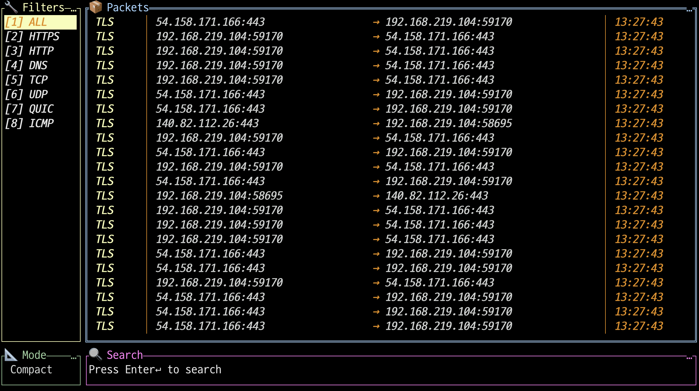

# netmon

A real-time network packet monitor with a beautiful TUI interface, built with Go. Monitor DNS, TCP, UDP, HTTP, HTTPS, QUIC, and ICMP traffic in your terminal.





## Installation

```sh
curl -fsSL https://raw.githubusercontent.com/fe-dudu/netmon/main/install.sh | sudo sh
```
This will download the appropriate binary for your platform and install it to `/usr/local/bin/netmon`.

## Features

- **Real-time packet monitoring** with live updates
- **Protocol filtering** (ALL, TCP, UDP, QUIC, DNS, HTTP, HTTPS, ICMP)
- **IP search** functionality
- **Color-coded protocols** for easy identification


## Usage

1. Run the program (requires `sudo` for packet capture):
```sh
sudo netmon
```
The program will automatically attach to all detected active interfaces (skipping loopback/virtual) so you can see traffic across Wi‑Fi/Ethernet/VPN simultaneously.


2. Use keyboard shortcuts:
- `1`: ALL - All IPv4/IPv6 traffic (L3)
- `2`: HTTPS - HTTPS (HTTP over TLS over TCP 443) (L7, encrypted)
- `3`: HTTP - HTTP over TCP ports 80/8080 (L7)
- `4`: DNS - DNS queries and responses (L7)
- `5`: TCP - All TCP packets (L4)
- `6`: UDP - All UDP packets (L4)
- `7`: QUIC - QUIC over UDP port 443 (UDP-based transport)
- `8`: ICMP - ICMP/ICMPv6 packets (L3)
- `M`: Toggle display mode (Expanded/Compact)
  - **Expanded**: Full IP addresses (no truncation), timestamp with milliseconds
  - **Compact** (default): Truncated IP addresses (35 chars), timestamp with seconds only
- `Enter`: Enter search mode
- `ESC`: Exit search mode, Quit
